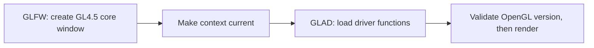

# Scotch: stack decisions

**21 September 2026 | Windows | Hazel course project**

Keep the architecture and existing vendors. The VS 2026 restoration required one library upgrade.

| Component | Decision | Reason |
|---|---|---|
| Visual Studio / Premake | **Upgraded** | VS 2026, v145, Premake **5.0.0-beta8**; generates `Scotch.slnx`. |
| spdlog / fmt | **Required update** | **1.11 / 9.1 to 1.14.1 / 10.2.1**; old fmt used `stdext::checked_array_iterator`, removed by MSVC. |
| C++17 | **Keep** | No language migration required. |
| GLFW / GLAD / OpenGL | **Keep** | Existing renderer works with **OpenGL 4.5 core**. |
| ImGui / ImGuizmo | **Keep** | Build configuration and editor input fixes were sufficient. |
| GLM / EnTT / yaml-cpp / stb_image | **Keep** | No upgrades required for restoration. |

**No fork updates required.** Only [spdlog's pin](https://github.com/gabime/spdlog/releases/tag/v1.14.1) changes. Vendor source files remain unpatched.

## Vendor integration

The GLFW / GLAD / OpenGL foundation follows the conventional sequence:

Forks, Premake, and compiled-in ImGui backends also appear in the [public Hazel course snapshot](https://github.com/TheCherno/Hazel/tree/1feb70572fa87fa1c4ba784a2cfeada5b4a500db). These are reasonable choices; the following integration defects needed repair.

| Area | Fixed |
|---|---|
| Build | ImGuizmo definition order; consistent **/MDd Debug / /MD Release and Dist**. |
| Rendering | Explicit GL4.5 requirement; texture-batch overflow; empty draws; buffer-size arithmetic; Sandbox shader mismatch. |
| Editor | Picking bounds; gizmo/window drag conflict; fallback fonts. |
| Scene files | Failed loads and cancelled Save As preserve the active scene/path; write failures are reported. |
| Lifecycle | VSync state; layer detachment; release UI/GPU resources before destroying the context. |

## Verified results

Tested with **VS 2026 Insiders / MSVC 14.51** and **RTX 4090 Laptop / OpenGL 4.5**.

| Check | Result |
|---|---|
| Debug / Release / Dist x64, all targets | **Passed** |
| Editor + Sandbox rendering and shutdown | **Passed; exit code 0** |
| Picking, gizmo dragging, save/new/reload, failed load, cancelled Save As | **Passed in the editor** |
| Three existing scenes, 33 textures in both draw paths, picking bounds, resource cleanup | **Passed in the scene/render smoke suite** |

**Remaining limits:** the shader assumes **32 fragment texture units**; GL4.5 guarantees only 16. Other GPUs were not tested, and existing compiler warnings remain.

[Build and run](README.md) | [Regression checks](tests/README.md)
